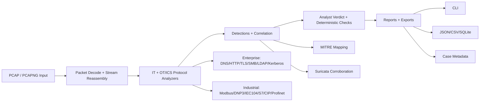

# Pcapper


```text
  ____                                                    
 |  _ \  ___ __ _ _ __  _ __   ___ _ __                  
 | |_) |/ __/ _` | '_ \| '_ \ / _ \ '__|                 
 |  __/| (_| (_| | |_) | |_) |  __/ |                    
 |_|    \___\__,_| .__/| .__/ \___|_|                    
                 |_|   |_|                              
  PCAP triage for IT + OT/ICS, fast enough for the plant floor
```

**Pcapper** is a modular PCAP/PCAPNG analysis CLI for fast triage and deep-dive protocol investigations across enterprise IT and ICS/OT traffic.

**OT/ICS READY** — plant-floor triage in minutes, not hours.

Built for blue teams, DFIR responders, and OT defenders who need fast answers with evidence-rich outputs.

> Install and run in under a minute: `pip install -r requirements.txt` then `python -m pcapper capture.pcap --threats --ips --timeline -ip 10.0.0.5`

## Why Teams Pick Pcapper

| You Need | Pcapper Delivers |
| --- | --- |
| Fast first-pass triage | One-pass summaries across hosts, services, protocols, and threats |
| Forensic depth when needed | Deterministic checks, pivots, timelines, and risk matrices |
| OT + IT in one workflow | Industrial protocol decoding plus enterprise threat-hunting views |
| Output that can be actioned | Analyst verdicts and evidence lines built for investigations |

## Built for Real Incidents

- SOC triage for suspicious captures with immediate threat signal extraction.
- IR/DFIR workflows where explainability and deterministic evidence matter.
- OT/ICS incident response for control-plane visibility and safety-oriented context.
- Purple-team and lab validation with ATT&CK mapping and IDS corroboration.

## Product Highlights

- **Analyst-grade reporting**: verdict, confidence, deterministic checks, risk matrix, pivots, and false-positive context.
- **MITRE ATT&CK mapping**: enterprise + ICS TTP alignment with technique heat and host-centric attack paths.
- **Suricata integration**: local IDS execution with structured metadata, event coverage, and pivots.
- **Protocol depth**: broad IT plus OT/ICS protocol coverage for mixed-network environments.
- **Case-friendly exports**: JSON/CSV/SQLite plus case metadata and provenance artifacts.

## 30-Second Quickstart

```bash
# 1) Install
pip install -r requirements.txt

# 2) Fast first-pass triage
python -m pcapper capture.pcap --threats --ips --timeline -ip 10.0.0.5

# 3) Deep-dive with ATT&CK + IDS corroboration
python -m pcapper capture.pcap --mitre --suricata --services --protocols

# 4) Export case-ready artifacts
python -m pcapper capture.pcap --json out/results.json --sqlite out/results.db --case-dir case-001
```

## Top 5 Commands by Use Case

```bash
# 1) Fast triage (best first command)
python -m pcapper capture.pcap --threats --ips --health

# 2) Host-centric hunt timeline
python -m pcapper capture.pcap --timeline -ip 10.0.0.5 --protocols --services

# 3) ATT&CK + IDS corroboration
python -m pcapper capture.pcap --mitre --suricata

# 4) Exfiltration, file transfer, and messaging/email artifact hunt
python -m pcapper capture.pcap --exfil --files --ftp --http --aim --email

# 5) OT/ICS deep-dive
python -m pcapper capture.pcap --modbus --dnp3 --iec104 --s7 --ot-commands --safety
```

## Architecture At A Glance



## Which Flag Should I Use?

| If You Want To... | Start With |
| --- | --- |
| Get immediate risk triage | `--threats --ips --health` |
| Hunt C2 or beaconing behavior | `--beacon --dns --tls --quic` |
| Map findings to ATT&CK | `--mitre` |
| Corroborate with IDS alerts | `--suricata` |
| Investigate data theft and transferred artifacts | `--exfil --files --ftp --http --aim --email` |
| Investigate identity abuse | `--kerberos --ldap --ntlm --domain --creds` |
| Track lateral movement | `--hostnames --services --protocols --tcp --timeline -ip <host>` |
| Run OT/ICS-specific triage | `--modbus --dnp3 --iec104 --s7 --ot-commands --safety` |
| Build IR exports and evidence packs | `--json --csv --sqlite --case-dir` |

## Sample Analyst Report

```text
ANALYST VERDICT
LIKELY - MULTIPLE CORROBORATING RISK INDICATORS DETECTED (confidence: MEDIUM)

DETERMINISTIC CHECKS
[!] Indicator quality gate: 3
  - 203.0.113.44 quality=4 AbuseIPDB score=85 reports=12
[!] Boundary cross-zone contact: 2
  - 10.0.0.10->203.0.113.44 TCP packets=600
[!] Intent heuristics: 2
  - 10.0.0.10->203.0.113.44 admin ports observed 445,3389

RISK MATRIX
Category                   Risk   Confidence   Evidence
Indicator Quality          High   High         3
Boundary Exposure          Medium Medium       2
Critical Asset Contact     High   High         1

TOP HUNT PIVOTS
- flow=10.0.0.10->203.0.113.44 proto=TCP packets=600 bytes=2.9 MB
  reasons=Lateral movement posture score; Cross-zone outbound contact
```

The goal is actionable signal, not noisy packet dumps.

## Before vs After Pcapper

| Traditional PCAP Workflow | With Pcapper |
| --- | --- |
| Manually pivot protocol by protocol | Single command gives cross-protocol triage |
| Raw packet dumps with limited context | Deterministic checks + verdict + confidence |
| Ad-hoc analyst notes for evidence | Built-in pivots and evidence-rich summaries |
| Separate OT and IT tooling chains | Unified OT/ICS + enterprise workflow |
| Time-consuming report assembly | Case-ready exports (JSON/CSV/SQLite + metadata) |

## Who Uses Pcapper

- SOC analysts triaging suspicious captures under time pressure.
- Incident responders and DFIR teams building evidence-driven narratives.
- OT/ICS defenders investigating control-network anomalies safely.
- Purple teams validating detections and ATT&CK coverage.
- Security engineering teams building repeatable PCAP triage runbooks.

| Focus | What You Get |
| --- | --- |
| Speed | First-pass answers in minutes, not hours |
| Depth | Protocol-aware summaries, artifacts, and anomalies |
| OT/ICS | Control-plane context and safety-aware detections |

```
Capture -> Decoders -> Sessions -> Detections -> Reports
   .pcap     300+       RDP/SSH      Beaconing   CLI/JSON/SQLite
```

Promotional highlights:
- Remote-access session visibility (RDP/SSH/WinRM/VNC/TeamViewer/Telnet) with endpoints, timing, and data volume.
- OT-aware findings that call out control actions, safety signals, and protocol-specific risks.
- Evidence-first reporting that surfaces context, not just counts.

## Current Release: v1.8.0

Latest additions in this release:
- Expanded OT transfer detection in `--files` with CIP File Object services and vendor-specific PLC transfer signatures.
- `--files` OT/ICS artifacts now retain payload data so `-extract`, `-view`, and `-raw` work consistently for supported industrial transfers.
- Reduced false-positive OT firmware transfer detections by excluding generic HTTP web assets from OT firmware heuristics.
- CLI help menus and README flag inventories were synchronized with live parser output.
- Release hygiene now git-ignores sensitive generated forensic output directories (`carved/`, `decrypted/`, `case/`, `case-*/`).

## OT/ICS Command Center

Industrial networks are first-class here: deep protocol coverage, safety-conscious detections, and context that reads like an OT incident timeline instead of a raw packet dump.

Signal > noise for substations, plants, and mixed IT/OT environments.

What you get:
- Dedicated OT protocol analyzers (IEC-104, DNP3, S7, Profinet, EtherNet/IP, MMS, and more).
- OT-aware timing/jitter insights for control traffic.
- Analyst-friendly outputs tuned for plant floors, substations, and mixed IT/OT environments.
- Control-command visibility for safety/availability impacts (writes, downloads, starts/stops).
- Control-loop validation on Modbus/DNP3 value changes (rate-of-change, oscillation, outliers).
- Safety PLC/SIS protocol detection (Triconex/TriStation heuristics).
- OT/ICS-centric threat and anomaly rollups with evidence lines for fast triage.
- Device fingerprinting across IT/OT/IoT traffic (vendor/model/OS/firmware/software) for asset-aware triage.
- Remote-access session visibility (RDP/SSH/WinRM/VNC/TeamViewer/Telnet) with endpoints, timing, and data volume.
- Deeper OT protocol decoding for DNP3, IEC 61850 GOOSE/SV, Modbus, BACnet, OPC UA, CoAP, MQTT, and CIP/ENIP.
- Routing protocol forensics (OSPF/BGP/IS-IS/PIM) with route-change, auth, and control-plane health visibility.

## Install

```bash
pip install -r requirements.txt
```

For development:

```bash
pip install -e .
```

### Platform Notes

- `--bpf` filtering depends on libpcap. On Windows, install Npcap and ensure Scapy can access it. If BPF is unavailable, Pcapper will fall back to non-BPF packet parsing.
- Colored output is enabled only for TTYs. Use `--no-color` or set `NO_COLOR=1` to disable ANSI colors.

## Usage

```bash
python -m pcapper <target> [options]
```

`target` accepts one or more values:
- a single file (`capture.pcap`)
- a directory (`~/Downloads/pcaps/`)
- wildcard patterns (`~/Downloads/pcaps/Un*`)
- multiple explicit targets (for example shell-expanded wildcards)

Examples:

```bash
python -m pcapper ~/Downloads/pcaps/MIME11.pcap --ips
python -m pcapper ~/Downloads/pcaps/ --arp
python -m pcapper ~/Downloads/pcaps/ --dhcp --no-status
python -m pcapper ~/Downloads/pcaps/Un* --arp
python -m pcapper "~/Downloads/pcaps/Un*" --summarize --ips
python -m pcapper one.pcap two.pcapng ~/Downloads/pcaps/ --summarize --timeline -ip 10.182.207.28
```

## Quick Demo

```text
========================================================================
RDP ANALYSIS :: sample.pcap
========================================================================
Total Packets            : 214,993
RDP Packets              : 18,876
Total Bytes              : 133.42 MB
Client -> Server         : 21.07 MB
Server -> Client         : 112.35 MB
Duration                 : 2h 13m 14.2s
Sessions                 : 14
TCP Sessions             : 9
UDP Sessions             : 5
Unique Clients           : 3
Unique Servers           : 3
------------------------------------------------------------------------
Top RDP Clients & Servers
Clients                  Servers
10.51.142.55(17481)       10.180.81.111(17481)
10.51.137.116(1560)       10.180.81.123(1560)
10.182.106.47(8)          10.180.81.139(8)
------------------------------------------------------------------------
RDP Sessions
Client                   Server                   Start                     End                       Duration    Packets  Size
10.51.142.55:51332        10.180.81.111:3389       2026-02-19T09:12:42Z      2026-02-19T11:25:54Z      2h 13m 12s  17481    104.2 MB
10.51.137.116:55190       10.180.81.123:3389       2026-02-19T12:01:04Z      2026-02-19T12:27:33Z      26m 29s    1560     12.7 MB
========================================================================
```

Secrets/credentials are displayed in reports by default.
Exports (JSON/CSV/SQLite) include full values by default.
Use `-v/--verbose` to include additional evidence lines in summaries (for example file artifacts, LDAP anomalies, and OT/ICS command details).

## Summarize behavior

Use `--summarize` to aggregate selected analyses across all resolved target pcaps.

- Summarize renders merged rollup output only (no per‑pcap sections).
- Recursive directory traversal is enabled only with `-r/--recursive`.

## Decryption

Pcapper can drive a tshark-based TLS/SSH decryption workflow when key logs are available.

Example:

```bash
python -m pcapper capture.pcap --tls --decrypt --tls-keylog ~/sslkeys.log --decrypt-out decrypted/
```

Notes:
- `tshark` must be installed and on `PATH`.
- TLS uses NSS `SSLKEYLOGFILE` format. SSH decryption depends on tshark keylog support.

## Stream Carving

Reassemble TCP streams and carve common file signatures.

```bash
python -m pcapper capture.pcap --carve --carve-out carved/
```

## Obfuscation Heuristics

Detect high‑entropy or encoded payloads that may indicate tunneling or obfuscation.

```bash
python -m pcapper capture.pcap --obfuscation
```

## Control-Loop Validation

Analyze Modbus/DNP3 value changes for rapid shifts, oscillations, and outliers.

```bash
python -m pcapper capture.pcap --control-loop
```

## Safety PLC Detection

Detect safety PLC/SIS protocol traffic (Triconex/TriStation heuristics).

```bash
python -m pcapper capture.pcap --safety
```

## Kill-Chain Timeline Tags

Timeline output includes attribution tags and causal links between related events.

```bash
python -m pcapper capture.pcap --timeline -ip 10.0.0.5
```

## LOLBAS Recognition

File transfer analysis highlights living-off-the-land binary artifacts when observed.

```bash
python -m pcapper capture.pcap --files
```

## Correlation

Correlate repeated hosts/services across multiple pcaps.

```bash
python -m pcapper captures/*.pcap --correlate --summarize
```

## Case Metadata

When using `--case-dir`, Pcapper writes `case.json` with analyst info, hashes, timestamps, and CLI options.

## Baselines

Snapshot asset and command baselines, then compare for drift.

```bash
python -m pcapper capture.pcap --baseline-save baseline.json
python -m pcapper capture.pcap --baseline-compare baseline.json
```

## Rules

Apply rule packs to detections.

```bash
python -m pcapper capture.pcap --rules rules.json
```

Minimal `rules.json` example:

```json
[
  {
    "id": "OT_CONTROL_WRITE",
    "title": "OT control writes",
    "severity": "high",
    "match": {
      "all": [
        {"field": "source", "op": "in", "value": ["ot_commands", "iec104", "modbus", "dnp3", "s7"]}
      ],
      "any": [
        {"field": "summary", "op": "regex", "value": "control|write"},
        {"field": "details", "op": "regex", "value": "setpoint|operate"}
      ]
    }
  }
]
```

## IOC Enrichment

You can provide enriched IOC metadata via JSON.

```json
{
  "indicators": [
    {
      "value": "1.2.3.4",
      "type": "ip",
      "source": "VendorX",
      "confidence": 80,
      "mitre": ["TA0011"],
      "tags": ["c2"]
    }
  ]
}
```

## Configuration

Pcapper can load default flag values from a TOML config file. Lookup order:
- `./pcapper.toml`
- `~/.pcapper.toml`
- `~/.config/pcapper/config.toml`

You can also supply `--config PATH` or set `PCAPPER_CONFIG` to override the location.

Example:

```toml
[defaults]
no_color = true
timeline_bins = 48
vt = true
log_file = "pcapper.log"
log_json = true
```

Config keys match argparse dest names (use underscores, not dashes).

## Logging

Use `--log-file PATH` to emit structured events and `--log-json` for JSONL output. If no `--log-file` is provided, JSON logs are sent to stderr.

## Plugins

Pcapper supports analyzers via entry points under the `pcapper.plugins` group. A plugin should return one or more `PluginSpec` instances from `pcapper.plugins`.
Only install plugins from sources you trust; plugin code is imported and executed in-process.

Minimal example (in your plugin package):

```python
from pcapper.plugins import PluginSpec

def register():
    return PluginSpec(
        name="my_analyzer",
        flag="--my-analyzer",
        help="Custom analyzer example",
        group="it",
        analyze=analyze_my_analyzer,
        render=render_my_analyzer,
        merge=merge_my_analyzer,
        title="MY ANALYZER",
    )
```

## CLI Flag Groups

Pcapper help is split into:
- `GENERAL FLAGS`
- `IT/ENTERPRISE FUNCTIONS`
- `OT/ICS/INDUSTRIAL FUNCTIONS`

Both IT and ICS/OT function groups are alphabetically ordered.

You can verify the live menu any time with:

```bash
python -m pcapper --help
```

### General flags

- `--base`
- `--baseline-compare PATH`
- `--baseline-fast`
- `--baseline-save PATH`
- `--bpf EXPR`
- `--carve`
- `--carve-limit N`
- `--carve-max-bytes N`
- `--carve-out DIR`
- `--carve-stream-bytes N`
- `--case-analyst NAME`
- `--case-dir DIR`
- `--case-id ID`
- `--case-name NAME`
- `--case-notes TEXT`
- `--config PATH`
- `--correlate`
- `--correlate-min N`
- `--csv PATH`
- `--decode INPUT`
- `--decrypt`
- `--decrypt-limit N`
- `--decrypt-out DIR`
- `--ioc-file PATH`
- `--json PATH`
- `--list-plugins`
- `--log-file PATH`
- `--log-json`
- `--no-color`
- `--no-status`
- `--packet N`
- `--profile`
- `--profile-out PATH`
- `--rules PATH`
- `--search STRING`
- `--self-check`
- `--sqlite PATH`
- `--ssh-keylog PATH`
- `--streams-full`
- `--time-end TIME`
- `--time-start TIME`
- `--timeline-bins N`
- `--timeline-storyline-off`
- `--tls-keylog PATH`
- `-aes KEY`
- `-case`
- `-categories, --timeline-categories LIST`
- `-established`
- `-exe`
- `-extract FILENAME`
- `-hash FILENAME`
- `-high`
- `-host`
- `-id STREAM_ID`
- `-ip TIMELINE_IP`
- `-l, --limit-protocols N`
- `-mac LOOKUP_MAC`
- `-name HOSTNAME`
- `-port STREAM_PORT`
- `-post`
- `-r, --recursive`
- `-raw` (shows `-view`/`--packet` output as raw text, no ASCII/HEX framing)
- `-rsa KEY_OR_@PATH`
- `-search TERM`
- `-summarize, --summarize`
- `-v, --verbose`
- `-view FILENAME`
- `-vt, --vt`
- `-xor KEY`

### IT/Enterprise functions (alphabetical)

- `--aim`
- `--arp`
- `--beacon`
- `--certificates`
- `--compromised`
- `--creds`
- `--ctf`
- `--dhcp`
- `--dns`
- `--domain`
- `--email`
- `--encrypted-dns`
- `--exfil`
- `--files`
- `--ftp`
- `--health`
- `--hostdetails`
- `--hostnames`
- `--http`
- `--http2`
- `--icmp`
- `--ioc`
- `--ip`
- `--ips`
- `--kerberos`
- `--ldap`
- `--mac`
- `--malware`
- `--mitre`
- `--netbios`
- `--nfs`
- `--ntlm`
- `--ntp`
- `--obfuscation`
- `--overview`
- `--opc-classic`
- `--pcapmeta`
- `--powershell`
- `--protocols`
- `--qos`
- `--quic`
- `--rdp`
- `--routing`
- `--rpc`
- `--scan`
- `--secrets`
- `--services`
- `--sizes`
- `--smb`
- `--smtp`
- `--snmp`
- `--ssdp`
- `--ssh`
- `--streams`
- `--strings`
- `--suricata`
- `--suricata-config`
- `--suricata-eve-types`
- `--suricata-only-sid`
- `--suricata-rules`
- `--suricata-strict`
- `--suricata-suppress-sid`
- `--syslog`
- `--tcp`
- `--teamviewer`
- `--telnet`
- `--threats`
- `--timeline`
- `--tls`
- `--tlsm`
- `--udp`
- `--vlan`
- `--vnc`
- `--vpn`
- `--webrequests`
- `--winrm`
- `--wlan`
- `--wmic`

Count: 78 flags

### OT/ICS/Industrial functions (alphabetical)

- `--bacnet`
- `--cip`
- `--coap`
- `--control-loop`
- `--crimson`
- `--csp`
- `--df1`
- `--dnp3`
- `--enip`
- `--ethercat`
- `--fins`
- `--goose`
- `--hart`
- `--honeywell`
- `--iccp`
- `--iec101-103`
- `--iec104`
- `--lldp`
- `--melsec`
- `--mms`
- `--modbus`
- `--modicon`
- `--mqtt`
- `--niagara`
- `--odesys`
- `--opc`
- `--ot-commands`
- `--ot-commands-config`
- `--ot-commands-fast`
- `--ot-commands-sessions`
- `--pccc`
- `--pcworx`
- `--prconos`
- `--profinet`
- `--ptp`
- `--s7`
- `--safety`
- `--srtp`
- `--sv`
- `--yokogawa`

Count: 40 flags

## Notes

- For timeline mode, supply `-ip` with `--timeline`.
- Use `-categories`/`--timeline-categories` with `--timeline` to filter event categories (comma-separated). Use `-categories false` or an empty value to print the supported list.
- Timeline output always shows all events (independent of `-v`) and includes TCP SYN/SYN-ACK connection events with port visibility.
- Use `--timeline-bins` to control OT activity sparkline resolution and `--timeline-storyline-off` to disable the storyline block.
- If your shell expands wildcards (for example `Un*`), pcapper now accepts the resulting multiple target arguments directly.
- Use `--no-status` for cleaner output in logs/pipelines.
- `--ot-commands-config` accepts JSON/YAML with `write_markers` and `protocol_markers` overrides (YAML requires PyYAML).
- Use `--ot-commands-sessions` to change the number of session rows in the OT commands block.
- VirusTotal lookups require `VT_API_KEY` and `-vt`/`--vt`.
- Set `PCAPPER_QUOTE` to override the banner quote, or `PCAPPER_QUOTE_SEED` for deterministic rotation.
- Output ordering is deterministic by default; set `PCAPPER_DETERMINISTIC=0` to restore Python's default Counter tie ordering.
- Use `--self-check` for a quick dependency and environment check, and `--list-plugins` to inspect loaded plugins.

## License

MIT
