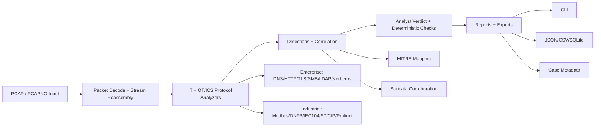

# Pcapper


```text
  ____                                                    
 |  _ \  ___ __ _ _ __  _ __   ___ _ __                  
 | |_) |/ __/ _` | '_ \| '_ \ / _ \ '__|                 
 |  __/| (_| (_| | |_) | |_) |  __/ |                    
 |_|    \___\__,_| .__/| .__/ \___|_|                    
                 |_|   |_|                              
  PCAP triage for IT + OT/ICS, fast enough for the plant floor
```

**Pcapper** is a modular PCAP/PCAPNG analysis CLI for fast triage and deep-dive protocol investigations across enterprise IT and ICS/OT traffic.

**OT/ICS READY** — plant-floor triage in minutes, not hours.

Built for blue teams, DFIR responders, and OT defenders who need fast answers with evidence-rich outputs.

> Install and run in under a minute: `pip install -r requirements.txt` then `python -m pcapper capture.pcap --threats --ips --timeline -ip 10.0.0.5`

## Why Teams Pick Pcapper

| You Need | Pcapper Delivers |
| --- | --- |
| Fast first-pass triage | One-pass summaries across hosts, services, protocols, and threats |
| Forensic depth when needed | Deterministic checks, pivots, timelines, and risk matrices |
| OT + IT in one workflow | Industrial protocol decoding plus enterprise threat-hunting views |
| Output that can be actioned | Analyst verdicts and evidence lines built for investigations |

## Built for Real Incidents

- SOC triage for suspicious captures with immediate threat signal extraction.
- IR/DFIR workflows where explainability and deterministic evidence matter.
- OT/ICS incident response for control-plane visibility and safety-oriented context.
- Purple-team and lab validation with ATT&CK mapping and IDS corroboration.

## Product Highlights

- **Analyst-grade reporting**: verdict, confidence, deterministic checks, risk matrix, pivots, and false-positive context.
- **MITRE ATT&CK mapping**: enterprise + ICS TTP alignment with technique heat and host-centric attack paths.
- **Suricata integration**: local IDS execution with structured metadata, event coverage, and pivots.
- **Protocol depth**: broad IT plus OT/ICS protocol coverage for mixed-network environments.
- **Case-friendly exports**: JSON/CSV/SQLite plus case metadata and provenance artifacts.

## 30-Second Quickstart

```bash
# 1) Install
pip install -r requirements.txt

# 2) Fast first-pass triage
python -m pcapper capture.pcap --threats --ips --timeline -ip 10.0.0.5

# 3) Deep-dive with ATT&CK + IDS corroboration
python -m pcapper capture.pcap --mitre --suricata --services --protocols

# 4) Export case-ready artifacts
python -m pcapper capture.pcap --json out/results.json --sqlite out/results.db --case-dir case-001
```

## Top 5 Commands by Use Case

```bash
# 1) Fast triage (best first command)
python -m pcapper capture.pcap --threats --ips --health

# 2) Host-centric hunt timeline
python -m pcapper capture.pcap --timeline -ip 10.0.0.5 --protocols --services

# 3) ATT&CK + IDS corroboration
python -m pcapper capture.pcap --mitre --suricata

# 4) Exfiltration, file transfer, and messaging/email artifact hunt
python -m pcapper capture.pcap --exfil --files --ftp --http --aim --email

# 5) OT/ICS deep-dive
python -m pcapper capture.pcap --modbus --dnp3 --iec104 --s7 --ot-commands --safety
```

## Architecture At A Glance


```mermaid
flowchart LR
  A[PCAP / PCAPNG Input] --> B[Packet Decode + Stream Reassembly]
  B --> C[IT + OT/ICS Protocol Analyzers]
  C --> D[Detections + Correlation]
  D --> E[Analyst Verdict + Deterministic Checks]
  E --> F[Reports + Exports]

  C --> C1[Enterprise: DNS/HTTP/TLS/SMB/LDAP/Kerberos]
  C --> C2[Industrial: Modbus/DNP3/IEC104/S7/CIP/Profinet]
  D --> D1[MITRE Mapping]
  D --> D2[Suricata Corroboration]
  F --> F1[CLI]
  F --> F2[JSON/CSV/SQLite]
  F --> F3[Case Metadata]
```

## Which Flag Should I Use?

| If You Want To... | Start With |
| --- | --- |
| Get immediate risk triage | `--threats --ips --health` |
| Hunt C2 or beaconing behavior | `--beacon --dns --tls --quic` |
| Map findings to ATT&CK | `--mitre` |
| Corroborate with IDS alerts | `--suricata` |
| Investigate data theft and transferred artifacts | `--exfil --files --ftp --http --aim --email` |
| Investigate identity abuse | `--kerberos --ldap --ntlm --domain --creds` |
| Track lateral movement | `--hostnames --services --protocols --tcp --timeline -ip <host>` |
| Run OT/ICS-specific triage | `--modbus --dnp3 --iec104 --s7 --ot-commands --safety` |
| Build IR exports and evidence packs | `--json --csv --sqlite --case-dir` |

## Sample Analyst Report

```text
ANALYST VERDICT
LIKELY - MULTIPLE CORROBORATING RISK INDICATORS DETECTED (confidence: MEDIUM)

DETERMINISTIC CHECKS
[!] Indicator quality gate: 3
  - 203.0.113.44 quality=4 AbuseIPDB score=85 reports=12
[!] Boundary cross-zone contact: 2
  - 10.0.0.10->203.0.113.44 TCP packets=600
[!] Intent heuristics: 2
  - 10.0.0.10->203.0.113.44 admin ports observed 445,3389

RISK MATRIX
Category                   Risk   Confidence   Evidence
Indicator Quality          High   High         3
Boundary Exposure          Medium Medium       2
Critical Asset Contact     High   High         1

TOP HUNT PIVOTS
- flow=10.0.0.10->203.0.113.44 proto=TCP packets=600 bytes=2.9 MB
  reasons=Lateral movement posture score; Cross-zone outbound contact
```

The goal is actionable signal, not noisy packet dumps.

## Before vs After Pcapper

| Traditional PCAP Workflow | With Pcapper |
| --- | --- |
| Manually pivot protocol by protocol | Single command gives cross-protocol triage |
| Raw packet dumps with limited context | Deterministic checks + verdict + confidence |
| Ad-hoc analyst notes for evidence | Built-in pivots and evidence-rich summaries |
| Separate OT and IT tooling chains | Unified OT/ICS + enterprise workflow |
| Time-consuming report assembly | Case-ready exports (JSON/CSV/SQLite + metadata) |

## Who Uses Pcapper

- SOC analysts triaging suspicious captures under time pressure.
- Incident responders and DFIR teams building evidence-driven narratives.
- OT/ICS defenders investigating control-network anomalies safely.
- Purple teams validating detections and ATT&CK coverage.
- Security engineering teams building repeatable PCAP triage runbooks.

| Focus | What You Get |
| --- | --- |
| Speed | First-pass answers in minutes, not hours |
| Depth | Protocol-aware summaries, artifacts, and anomalies |
| OT/ICS | Control-plane context and safety-aware detections |

```
Capture -> Decoders -> Sessions -> Detections -> Reports
   .pcap     300+       RDP/SSH      Beaconing   CLI/JSON/SQLite
```

Promotional highlights:
- Remote-access session visibility (RDP/SSH/WinRM/VNC/TeamViewer/Telnet) with endpoints, timing, and data volume.
- OT-aware findings that call out control actions, safety signals, and protocol-specific risks.
- Evidence-first reporting that surfaces context, not just counts.

## What's New in v2.2.0 🛡️

**v2.2.0 is the correctness-and-assurance release.** No new analyzers — instead,
the reassembly and decryption paths were audited, three silent failure modes were
fixed, and the project gained the test suite and CI that would have caught them.

- 🧵 **TCP sequence wraparound is handled.** Both the carving and stream-following reassemblers sorted segments by raw 32-bit sequence number, so any stream whose initial sequence number sat near `2**32` was mis-assembled once it wrapped — and carving then found nothing and reported nothing. Roughly 1 ISN in 43 on a 100 MB transfer, which is exactly the large-file-exfil case `--carve` exists for.
- 🕳️ **A carve taken across a gap no longer carries a confident SHA-256.** Missing bytes used to be closed by concatenation, producing a spliced artifact with an authoritative-looking hash. Gaps are now zero-filled so offsets stay true to the stream, counted on every hit, and flagged in the rendered table, the note and the detection evidence.
- ⏱️ **`--decrypt` cannot hang forever.** Every tshark call now has a timeout; a stalled stream is recorded and skipped instead of taking the run with it. Stream labelling was also rebuilt — it was inert (`-c 1` caps packets *read*, not matched) and mislabelled every IPv6 stream — and now costs one pass instead of two per stream, so `--decrypt` went from 2N+1 capture reads to N+1.
- 🔐 **A filename off the wire no longer reaches the filesystem as a path.** Containment always held, but the probe itself was a problem: on Windows a UNC name in a capture turned an `exists()` check into an outbound SMB connection to a host the adversary named. Names are now reduced to a bare local component first.
- 🔎 **`--smb` stopped dropping names with spaces** — `Domain Admins`, `Backup Operators`, `Program Files` and friends were being filtered out of client inventory previews.
- ✅ **190 tests, and CI on Python 3.9 and 3.13**, with golden rendered output pinned per analyzer. The lint gate's first act was to find a Python 3.12-only f-string that had been breaking the package on 3.9–3.11.

See [CHANGELOG.md](CHANGELOG.md) for the full detail.

## What's New in v2.1.0 🔥

**v2.1.0 is the identity, asset-intelligence & OT-accuracy release.** pcapper now reads the wire the way an analyst does — *who is this host, what does it announce itself as, and is this actually notable* — and it stops crying wolf on quiet industrial segments.

- 🪪 **Full NetBIOS Browser (MS-BRWS) dissection** — the browser Mailslot is decoded, not counted. Every announcement hands you a host's **name, OS, server ROLES (Domain Controller / SQL / print / master browser), comment, and domain** — passive asset inventory + OS fingerprinting with zero probing. Plus a scored verdict and browser attack detections: **rogue master browser / forced-election takeover, PDC role conflict, NETLOGON user-enumeration** — mapped to **MITRE T1557 / T1046 / T1087** and rolled up in `--threats` and `--mitre`.
- 🧠 **Browser intelligence wired into 8 analyzers** — hostname / OS / roles / domain / DC identity now light up `--hostdetails`, `--domain`, `--hostnames`, `--ips`, `--overview`, `--compromised`, `--threats`, and `--mitre`. `--domain` maps your Active Directory (domain + DC roster) **with no Kerberos or LDAP traffic at all**, and a compromised DC is escalated as a crown-jewel.
- 🔬 **`--hostdetails` is now a full host-forensics dossier** — one `-ip` gives you identity + roles, usernames, services, web requests, **remote services out (with C2/remote-access flagging), remote access *in* (inbound RDP/SSH/VNC/WinRM/SMB with the connecting peer), authentication activity, TLS/JA3 fingerprints, SMB share access, email, peer geo/ASN/IOC intel**, DNS, and downloaded files with hashes.
- 🎯 **Systematic OT/DCS false-positive kill** — a benign Foxboro-DCS baseline (broadcast ARP + browser Mailslot, two DCs, no TCP) used to trip nearly every verdict engine. `--scan`, `--arp`, `--beacon`, `--protocols`, `--overview`, `--threats`, and `--mitre` are now segment-hub-, broadcast/multicast-, and rate-aware — a gateway/DC ARPing its subnet is *baseline*, not an "Nmap sweep" or "CRITICAL C2 beacon."

> Full detail in [CHANGELOG.md](CHANGELOG.md).

### Preview: a host tells you exactly what it is

```text
$ python -m pcapper capture.pcap --netbios

Announced Hosts & Roles (Browser / MS-BRWS)
Host    IP            OS                                Domain  Roles                                       Comment
0001DC  10.217.34.1   Windows 7 / Server 2008 R2 (6.1)  FOX     Server, Domain Controller (PDC), DFS Root   Domain Controller
0002DC  10.217.34.2   Windows 7 / Server 2008 R2 (6.1)  FOX     Server, SQL Server, Backup DC, DFS Root     -

$ python -m pcapper capture.pcap --hostdetails -ip 10.217.34.1

Host Identity
Hostname                 : 0001DC
Inferred OS / Device     : Windows 7 / Server 2008 R2 (6.1)
Announced Roles (Browser): Server, Domain Controller (PDC), Time Source, DFS Root, Terminal Server
Domain / Workgroup       : FOX
```

## What's New in v2.0.0 🚀

**v2.0.0 is the threat-hunt / incident-response release** — pcapper graduated from "PCAP analysis" to a full **threat-hunting, forensics, and IR/triage platform** for IT *and* OT/ICS. Every analyzer was reviewed function-by-function so it now reads like an analyst's notebook: a verdict, the evidence, and the ATT&CK technique — never a raw packet dump.

- 🎯 **IT→OT pivot detection** — the #1 industrial intrusion pattern, caught automatically. A remote login (SSH/RDP/WinRM/…) that lands on a host which then issues an OT command to another device is flagged **CRITICAL** across `--threats`, `--overview`, `--compromised`, and shown inline on the `--timeline`.
- 🛰️ **"Remote IN" timeline events** — inbound remote-access sessions to your focus host, colored by risk (external = CRITICAL, internal = HIGH), so the foothold shows up *before* the control action it enabled.
- 🔐 **Encrypted-traffic hunting** — JA3/JA4 malware-fingerprint matching, Cobalt Strike default-cert IOCs, **DoH-over-TLS via resolver SNI**, and crackable **Net-NTLM hash** reconstruction (Hashcat-ready).
- 🏭 **OT/ICS firepower** — ~15 new/expanded industrial analyzers (Synchrophasor/C37.118, BSAP, Genisys, EtherCAT, Modicon UMAS, MELSEC, …), accurate **ATT&CK-for-ICS** mapping with evidence, and full OT output by default.
- 🧹 **Big correctness + FP audit** — revived several silently-dead detectors (PsExec admin-share/pipe, WMI persistence, Modicon CPU start/stop) and cut a swath of false positives, all validated against ground-truth captures.
- ⚡ **Faster & leaner** — sub-analyzer memoization (~13%+ faster on OT captures, byte-identical output) and ~2,000 lines of de-duplication.

> See the full breakdown in [CHANGELOG.md](CHANGELOG.md).

### Preview: catching an IT→OT pivot

```text
$ python -m pcapper attack.pcap -ip 10.0.0.10 --timeline

Activity Timeline
Time                        | Category   | Summary
2023-11-14T22:13:20.200000Z | Remote IN  | [CRITICAL] Inbound SSH remote access (external/public source)
                            |            |   45.137.21.9 -> 10.0.0.10:22 (SSH) established
2023-11-14T22:13:25.300000Z | Modbus     | [OT Control] Modbus Write Single Register
                            |            |   10.0.0.10 -> 10.0.0.20:502 unit 1 Write Single Register

$ python -m pcapper attack.pcap --threats

Most Likely Scenarios
Sev   Source   Detection                                    Top Source      Top Destination
CRIT  Pivot    IT->OT pivot: remote access then OT command  45.137.21.9(1)  10.0.0.20(1)
  Host 10.0.0.10 accepted inbound SSH remote access from 45.137.21.9 (external/public
  source) and subsequently issued a Modbus command to 10.0.0.20.   [ATT&CK T0859 / T0855]
```

## Current Release: v2.2.0

Headline changes in this release:
- **Three silent failure modes in reassembly and decryption fixed** — sequence wraparound, gaps published with an authoritative hash, and an unbounded tshark call. See [CHANGELOG.md](CHANGELOG.md).
- **A test suite and CI** — 190 tests with golden rendered output, run on Python 3.9 and 3.13.
- **Wire-derived filenames are neutralised before touching the filesystem**, and a disclosure route exists in [SECURITY.md](SECURITY.md).

Carried forward from v2.1.0:
- **Full NetBIOS Browser (MS-BRWS) protocol dissection** in `--netbios` — announced host names, OS, server roles (DC/SQL/print/master browser), comments and domain, a scored verdict, and browser attack detections (rogue master browser, election storm, PDC conflict, NETLOGON enumeration) mapped to MITRE T1557 / T1046 / T1087.
- **Browser-derived host intelligence propagated to 8 analyzers** (`--hostdetails`, `--domain`, `--hostnames`, `--ips`, `--overview`, `--compromised`, `--threats`, `--mitre`) — passive AD/DC discovery with no Kerberos/LDAP required.
- **`--hostdetails` expanded into a full host dossier** — inbound + outbound remote access (with C2/remote-access flagging), authentication activity, TLS/JA3, SMB share access, email, and peer geo/ASN/IOC intelligence, alongside the existing identity/services/web/DNS/files.
- **Systematic OT/DCS false-positive elimination** — a shared unicast/broadcast gate plus segment-hub-role and rate awareness across `--scan`, `--arp`, `--beacon`, `--protocols`, `--overview`, `--threats`, and `--mitre` so a gateway/DC's routine ARP and Mailslot broadcast reads as baseline, not recon or C2.
- `--scan` and `--overview` now always render at full depth (no `-v` needed, no truncation footer); `--overview` "Notable Flows" is notability-aware instead of top-by-volume.

*Previous milestone (v2.0.x):* IT→OT pivot detection and "Remote IN" timeline events, CIP/EtherNet-IP timeline entries, DoH-over-SNI detection, per-analyzer Analyst Verdict + ATT&CK mapping, revived dead detectors, and sub-analyzer memoization performance work.

## OT/ICS Command Center

Industrial networks are first-class here: deep protocol coverage, safety-conscious detections, and context that reads like an OT incident timeline instead of a raw packet dump.

Signal > noise for substations, plants, and mixed IT/OT environments.

What you get:
- Dedicated OT protocol analyzers (IEC-104, DNP3, S7, Profinet, EtherNet/IP, MMS, and more).
- OT-aware timing/jitter insights for control traffic.
- Analyst-friendly outputs tuned for plant floors, substations, and mixed IT/OT environments.
- Control-command visibility for safety/availability impacts (writes, downloads, starts/stops).
- Control-loop validation on Modbus/DNP3 value changes (rate-of-change, oscillation, outliers).
- Safety PLC/SIS protocol detection (Triconex/TriStation heuristics).
- OT/ICS-centric threat and anomaly rollups with evidence lines for fast triage.
- Device fingerprinting across IT/OT/IoT traffic (vendor/model/OS/firmware/software) for asset-aware triage.
- Remote-access session visibility (RDP/SSH/WinRM/VNC/TeamViewer/Telnet) with endpoints, timing, and data volume.
- Deeper OT protocol decoding for DNP3, IEC 61850 GOOSE/SV, Modbus, BACnet, OPC UA, CoAP, MQTT, and CIP/ENIP.
- Routing protocol forensics (OSPF/BGP/IS-IS/PIM) with route-change, auth, and control-plane health visibility.

## Install

```bash
pip install -r requirements.txt
```

For development:

```bash
pip install -e .
```

### Platform Notes

- `--bpf` filtering depends on libpcap. On Windows, install Npcap and ensure Scapy can access it. If BPF is unavailable, Pcapper will fall back to non-BPF packet parsing.
- Colored output is enabled only for TTYs. Use `--no-color` or set `NO_COLOR=1` to disable ANSI colors.

## Usage

```bash
python -m pcapper <target> [options]
```

`target` accepts one or more values:
- a single file (`capture.pcap`)
- a directory (`~/Downloads/pcaps/`)
- wildcard patterns (`~/Downloads/pcaps/Un*`)
- multiple explicit targets (for example shell-expanded wildcards)

Examples:

```bash
python -m pcapper ~/Downloads/pcaps/MIME11.pcap --ips
python -m pcapper ~/Downloads/pcaps/ --arp
python -m pcapper ~/Downloads/pcaps/ --dhcp --no-status
python -m pcapper ~/Downloads/pcaps/Un* --arp
python -m pcapper "~/Downloads/pcaps/Un*" -summarize --ips
python -m pcapper one.pcap two.pcapng ~/Downloads/pcaps/ -summarize --timeline -ip 10.182.207.28
```

## Quick Demo

```text
========================================================================
RDP ANALYSIS :: sample.pcap
========================================================================
Total Packets            : 214,993
RDP Packets              : 18,876
Total Bytes              : 133.42 MB
Client -> Server         : 21.07 MB
Server -> Client         : 112.35 MB
Duration                 : 2h 13m 14.2s
Sessions                 : 14
TCP Sessions             : 9
UDP Sessions             : 5
Unique Clients           : 3
Unique Servers           : 3
------------------------------------------------------------------------
Top RDP Clients & Servers
Clients                  Servers
10.51.142.55(17481)       10.180.81.111(17481)
10.51.137.116(1560)       10.180.81.123(1560)
10.182.106.47(8)          10.180.81.139(8)
------------------------------------------------------------------------
RDP Sessions
Client                   Server                   Start                     End                       Duration    Packets  Size
10.51.142.55:51332        10.180.81.111:3389       2026-02-19T09:12:42Z      2026-02-19T11:25:54Z      2h 13m 12s  17481    104.2 MB
10.51.137.116:55190       10.180.81.123:3389       2026-02-19T12:01:04Z      2026-02-19T12:27:33Z      26m 29s    1560     12.7 MB
========================================================================
```

Secrets/credentials are displayed in reports by default.
Exports (JSON/CSV/SQLite) include full values by default.
Use `-v/--verbose` to include additional evidence lines in summaries (for example file artifacts, LDAP anomalies, and OT/ICS command details).

## Documentation

The per-feature reference — every analysis mode, its flags and a worked example —
lives in **[docs/reference.md](docs/reference.md)**:

- [Summarize behavior](docs/reference.md#summarize-behavior)
- [Decryption](docs/reference.md#decryption)
- [Stream Carving](docs/reference.md#stream-carving)
- [Obfuscation Heuristics](docs/reference.md#obfuscation-heuristics)
- [Control-Loop Validation](docs/reference.md#control-loop-validation)
- [Safety PLC Detection](docs/reference.md#safety-plc-detection)
- [Kill-Chain Timeline Tags](docs/reference.md#kill-chain-timeline-tags)
- [LOLBAS Recognition](docs/reference.md#lolbas-recognition)
- [Correlation](docs/reference.md#correlation)
- [Case Metadata](docs/reference.md#case-metadata)
- [Baselines](docs/reference.md#baselines)
- [Rules](docs/reference.md#rules)
- [IOC Enrichment](docs/reference.md#ioc-enrichment)
- [Configuration](docs/reference.md#configuration)
- [Logging](docs/reference.md#logging)
- [Plugins](docs/reference.md#plugins)
- [CLI Flag Groups](docs/reference.md#cli-flag-groups)
- [Notes](docs/reference.md#notes)

See also [CHANGELOG.md](CHANGELOG.md) (current releases),
[CHANGELOG-archive.md](CHANGELOG-archive.md) (2.0.2 and earlier) and
[SECURITY.md](SECURITY.md).

## License

MIT
